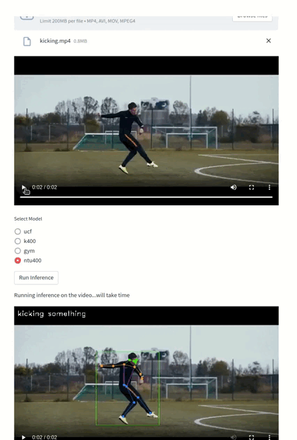
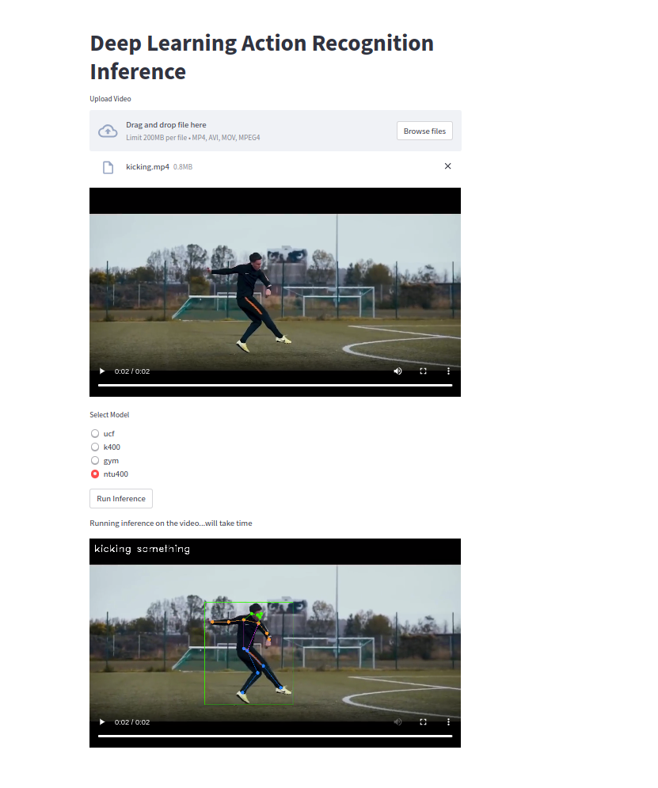

# Action Recognition Repository

Welcome to the Action Recognition Repository! This repository houses a project focused on action recognition. Here, I have developed inferences for multiple pre-trained action recognition models.

## Overview
I utilized the Streamlit framework to create a user-friendly web application. Through this application, users can easily upload videos and perform inference on them. You can watch a demo of the application [here](https://youtu.be/yaKarnjFTYg).

## Usage
To get started, follow these steps:

1. **Clone the Repository**: Begin by cloning this repository to your local machine.
2. **Install Dependencies**: Navigate to the repository directory and install the required packages. Detailed instructions for package installation are provided in the README_official.md file.
3. **Run the Application**: After installing the necessary packages within a virtual environment, install the Streamlit package using the following command:

To install Streamlit, run the following command:
```bash
pip install streamlit
```

Run streamlit
```bash
streamlit run application.py
```


For now you need to upload the video by first copying it into this current repo directory and uploading it from there.


